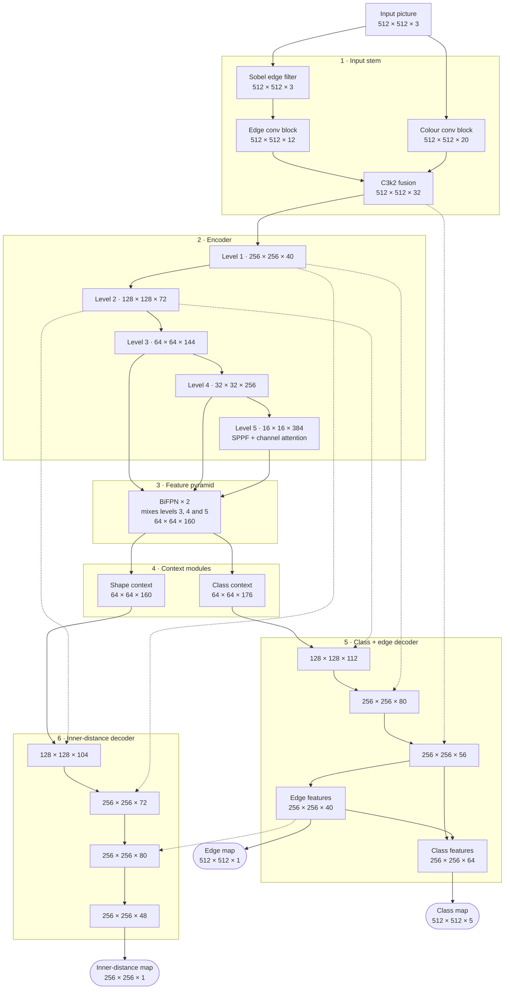

# Model V7: finding shapes on PCB images

Model V7 looks at a photo of a printed circuit board (PCB) and finds four kinds of shapes on it. For every shape it finds, it gives you:

- the **class**: which of the four kinds it is
- the **outline**: the exact pixels the shape covers, not just a box around it
- a **confidence score** from 0 to 1

The model was trained from scratch and is ready to use. The trained model file is on the [Releases page](https://github.com/Jenit88/Model_V7/releases); see [Use the trained model](#use-the-trained-model).


*Model V7 on a test image. Every shape it found is outlined and labelled with a number, its class and its confidence.*

## Contents

1. [What the model finds](#what-the-model-finds)
2. [Results](#results)
3. [How it works](#how-it-works)
4. [Model architecture](#model-architecture)
5. [How it was trained](#how-it-was-trained)
6. [Use the trained model](#use-the-trained-model)
7. [Check the scores yourself](#check-the-scores-yourself)
8. [Train your own model](#train-your-own-model)
9. [Run the tests](#run-the-tests)
10. [Limitations and things to know](#limitations-and-things-to-know)
11. [Files in this repository](#files-in-this-repository)

## What the model finds

| class | shape | shapes in the test set |
|---|---|---:|
| `Rectangle` | rectangular pad | 15,156 |
| `Rectangle_concave` | rectangle with a hollow or cut-out part | 108 |
| `circle` | ring: a circle with a hole in the middle | 3,272 |
| `circle_full` | solid circle | 14,952 |

## Results

The model was scored on pictures it never trained on:

- **validation set**, 1,048 images: used to pick the best version of the model
- **test set**, 432 images: kept aside and used only at the very end

| data | images | shapes | mask mAP50-95 | mAP50 | mAP75 | precision | recall | F1 |
|---|---:|---:|---:|---:|---:|---:|---:|---:|
| validation | 1,048 | 48,388 | **0.8515** | 0.9874 | 0.9712 | 0.9598 | 0.9839 | **0.9717** |
| test | 432 | 33,488 | **0.7554** | 0.9731 | 0.8470 | 0.9577 | 0.9810 | **0.9692** |

On the test set, per class:

| class | shapes | mask mAP50-95 | precision | recall |
|---|---:|---:|---:|---:|
| Rectangle | 15,156 | 0.8300 | 0.9421 | 0.9817 |
| Rectangle_concave | 108 | 0.8235 | 0.5025 | 0.9167 |
| circle | 3,272 | 0.5649 | 0.9730 | 0.9795 |
| circle_full | 14,952 | 0.8032 | 0.9767 | 0.9811 |

**What the numbers mean.** All scores go from 0 to 1, and higher is better.

- **IoU (overlap):** how much a predicted outline and the real outline cover the same pixels. 1 means identical.
- **Precision:** of the shapes the model found, the share that are real.
- **Recall:** of the real shapes, the share the model found.
- **F1:** one number that balances precision and recall.
- Precision, recall and F1 count a found shape as correct when its IoU with a real shape is at least 0.50.
- **mask mAP50** and **mAP75:** average precision when a match needs an IoU of at least 0.50 or 0.75.
- **mask mAP50-95:** the same, averaged over ten levels from 0.50 to 0.95. It rewards outlines that fit exactly.

**In short:** the model finds almost every shape (recall 0.98), and nearly everything it reports is real (precision 0.96). What is left to improve is mostly how exactly the outlines fit, plus the weak spots listed under [Limitations](#limitations-and-things-to-know).

Full tables, training logs, evaluation reports and more example pictures are in [`results/`](results/README.md).

## How it works

**1. Resize.** The picture is scaled to 512 × 512 pixels without stretching. Grey bars fill any empty space.

**2. Predict three maps.** The neural network reads the picture and outputs three maps:

| map | size | what it gives for each pixel |
|---|---|---|
| class map | 512 × 512 | background or one of the four classes, with a probability |
| edge map | 512 × 512 | how likely the pixel is on the edge of a shape |
| inner-distance map | 256 × 256 | 0 at the edge of a shape, rising to 1 in its middle |

The inner-distance map is the main idea. Every shape, big or small, looks the same in it: low at the edge, high in the middle. So each shape's middle is easy to find, even when two shapes touch.

**3. Turn the maps into shapes.** For each class:

1. Keep the pixels the network is at least 30% sure about. Pixels that touch form a blob.
2. In each blob, the high part of the inner-distance map (at least half of the blob's highest value) marks the middle of each shape. Each middle becomes one shape.
3. Every other pixel in the blob joins its nearest middle.
4. The edge map separates shapes that are still stuck together.
5. Very small pieces (under 13 pixels) are thrown away.

**4. Score each shape.** The confidence score combines two checks. First, does the predicted inner-distance map fit the shape's own outline? A clean, whole shape fits well; a broken piece, or two shapes merged into one, does not. Second, how sure is the network about the shape's class?

**5. Scale back.** The outlines are mapped back to the size of the original picture.

The network itself is explained part by part in [Model architecture](#model-architecture).

## Model architecture

This section explains how the network inside Model V7 is built, from the picture going in to the three maps coming out.

### The big picture

The network has six parts, and the picture flows through them in this order:

1. **Input stem:** looks at the colours of the picture and, separately, at its edges.
2. **Encoder:** makes the picture smaller step by step and learns more and more complex patterns.
3. **Feature pyramid:** mixes fine detail with big-picture information.
4. **Context modules:** look around every spot at several distances at once.
5. **Class + edge decoder:** makes the result bigger again and says which class each pixel is and where the edges are.
6. **Inner-distance decoder:** makes its own result bigger again and says where the middle of each shape is.

Parts 1 to 3 are shared. After that the network splits into two branches, because "which class is this pixel?" and "where is the middle of this shape?" are different questions. Each branch has its own context module and its own decoder.

Sizes are written as **height × width × channels**. Channels are the number of different features the network keeps for every spot; a colour picture has 3 (red, green and blue).



*Solid arrows are the main path. Dotted arrows are shortcuts that carry saved detail from earlier parts (and edge hints) into the decoders.*

### The six parts

| part | what it does | output size | learned parameters |
|---|---|---|---:|
| 1. Input stem | Runs a fixed edge filter (Sobel) next to a normal filter on the colours, then combines the two views. | 512 × 512 × 32 | 7,776 (0.1%) |
| 2. Encoder | Halves the size five times: 512 → 256 → 128 → 64 → 32 → 16. Each smaller level covers a bigger area of the board, so it can learn bigger patterns. The last level adds SPPF and channel attention. | 16 × 16 × 384 | 4,780,048 (75.4%) |
| 3. Feature pyramid | Two rounds of BiFPN mix levels 3, 4 and 5, so the 64 × 64 level also knows about large structures. | 64 × 64 × 160 | 752,013 (11.9%) |
| 4. Context modules | Two separate modules, one for each branch. Each looks at every spot and around it at three wider distances at the same time. | 64 × 64 × 176 (class) and 64 × 64 × 160 (shape) | 134,842 (2.1%) |
| 5. Class + edge decoder | Doubles the size twice (64 → 128 → 256). Each time it adds back the saved encoder level of the same size, so outlines stay sharp. It predicts the edge map first, then uses the edge features to help predict the class map. Both maps are smoothly scaled up to 512 × 512. | 512 × 512 × 5 and 512 × 512 × 1 | 325,574 (5.1%) |
| 6. Inner-distance decoder | Doubles the size twice in the same way, adds hints from the edge features, and predicts the inner-distance map. | 256 × 256 × 1 | 343,233 (5.4%) |
| **total** | | | **6,343,486** |

Both decoders stop at half size (256 × 256). This saves memory and time, and it keeps enough detail: the shapes in these pictures are mostly 16 to 36 pixels across. The class map and edge map are then smoothly scaled up to 512 × 512.

### The building blocks

| block | what it is, in simple words | where it is used |
|---|---|---|
| **Convolution** | A small learned filter, usually 3 × 3 pixels, that slides over the picture or feature map and reacts to a pattern, such as a corner or a curve. | everywhere (110 layers) |
| **Conv block** | Convolution, then group normalization (keeps the numbers in a steady range, and works well when only 2 images are trained at a time), then SiLU (a smooth on/off switch that lets the network learn curved, non-linear patterns). | everywhere |
| **Stride-2 convolution** | A convolution that jumps 2 pixels at a time, which halves the width and height. | encoder, feature pyramid |
| **Separable convolution** | A cheaper convolution done in two steps: first each channel on its own across space, then mixing the channels. | feature pyramid, context modules, edge branch (13 layers) |
| **Bottleneck** | Two conv blocks with a shortcut that adds the input to the output, so information passes through easily. | inside C3k2 |
| **C3k2 block** | Splits the channels into two halves. One half goes through bottlenecks, the other skips them. Then both halves are joined and mixed again. This idea comes from YOLO models. | input stem, encoder, both decoders |
| **SPPF** | Takes the maximum value in 5 × 5 windows, three times in a row, and joins all four versions. The deepest level then sees small, medium and large areas at once. | end of the encoder |
| **Channel attention** | Looks at the whole feature map, scores how useful each channel is for this picture, and turns channels up or down. | end of the encoder, context modules |
| **BiFPN** | Passes information from the smallest level to the largest (big picture into detail), then back again (detail into big picture). Where two levels meet, they are added with learned weights, so the network decides how much each level counts. | feature pyramid |
| **Dilated convolution** | A 3 × 3 filter with gaps between its points (gaps of 2, 4 or 6), so it covers a wider area without making the map smaller. | context modules |
| **Shortcut (skip) connection** | The decoder reuses detail saved by the encoder at the same size, so outlines stay sharp. | both decoders |
| **Upsampling** | Smooth (bilinear) resizing that doubles the width and height. | decoders, outputs |
| **Spatial dropout** | During training only: randomly switches off whole channels (10% in the class decoder, 5% in the inner-distance decoder), so the network does not depend on just a few features. | both decoders |
| **Sobel edge filter** | A fixed filter (not learned) that measures how fast brightness changes left to right and top to bottom. It gives 3 channels: horizontal change, vertical change and edge strength. | input stem |

### Inputs and outputs

| | name | size | values |
|---|---|---|---|
| input | `image` | 512 × 512 × 3 | RGB picture with values from 0 to 1, resized with grey bars |
| output | `semantic` | 512 × 512 × 5 | raw scores for background, `Rectangle`, `Rectangle_concave`, `circle` and `circle_full`; softmax turns them into probabilities |
| output | `boundary` | 512 × 512 × 1 | raw edge score; sigmoid turns it into a probability |
| output | `inner_distance` | 256 × 256 × 1 | 0 at the edge of a shape, 1 in its middle (already between 0 and 1) |

In total the network has 457 layers and 6,343,486 learned parameters. It computes in mixed precision (float16) and gives its outputs in float32. You do not have to handle these raw outputs yourself: `predict_one_image` in `model_v7.py` resizes the picture, runs the network, turns the maps into shapes and maps them back to the original picture (see [Use the trained model](#use-the-trained-model)).

## How it was trained

- **Data:** 4,680 training images (151,724 shapes), 1,048 validation images (48,388 shapes) and 432 test images (33,488 shapes). The labels are polygons in YOLO format. Where two label polygons overlapped, the overlap was cleaned up before training so every shape keeps its own pixels.
- **From scratch:** the network started with random weights. No pretrained weights were used.
- **Length:** 120 epochs (full passes over the training images), 11–14 September 2026, on one laptop GPU (NVIDIA RTX PRO 1000, 8 GB). One epoch takes about 34 minutes.
- **Augmentation:** each epoch shows the training images changed in different ways: rotations, flips, small zooms in and out, and changes to brightness, contrast, colour, blur and noise. This stops the model from relying on one exact view.
- **Loss:** one loss for each of the three maps. The inner-distance loss pays extra attention to pixels near the edges of shapes.
- **Settings:** AdamW optimiser. Learning rate 0.0003 with a 6-epoch warm-up, then lowered slowly to 0.000001 (cosine schedule). 2 images per step, with gradients added up over 2 steps (works like 4 images per step). Mixed precision (float16) to save GPU memory. A running average of the weights (EMA, 0.999).
- **Picking the best version:** from epoch 25, every 5 epochs the model was scored on 256 validation images and the best version so far was saved. At the end, three saved versions were compared on all 1,048 validation images. The version from **epoch 105** won; it is the released model.

## Use the trained model

### The model file

| | |
|---|---|
| file | `best_model_v7_instance.keras` |
| download | [Releases → v1.0](https://github.com/Jenit88/Model_V7/releases/tag/v1.0) |
| size | 231 MB |
| format | Keras model file, saved with TensorFlow 2.21 and Keras 3.15 |
| version | epoch 105 of 120, chosen on the validation set |
| parameters | 6,343,486 |
| input | any RGB picture (it is resized to 512 × 512 for you) |
| output | every shape found: class, outline, confidence, size and position |

The model is on the Releases page, not in the file list, because GitHub does not accept normal files larger than 100 MB.

### 1. Install

**You need:** Linux, or Windows with WSL2 (Ubuntu); Python 3.11; an NVIDIA GPU (strongly recommended).

```bash
git clone https://github.com/Jenit88/Model_V7.git
cd Model_V7
python3.11 -m venv ~/envs/pcb62
~/envs/pcb62/bin/pip install "tensorflow[and-cuda]==2.21.0" "keras==3.15.1" "numpy==2.4.6" "opencv-python-headless==5.0.0.93"
```

`env.sh` looks for the Python environment in `~/envs/pcb62`. If you made it somewhere else, run `export PCB_ENV=/your/env/folder` first.

### 2. Download the model

Put `best_model_v7_instance.keras` in `~/Models/Model_v7_scratch_rtx/`:

```bash
mkdir -p ~/Models/Model_v7_scratch_rtx
gh release download v1.0 --repo Jenit88/Model_V7 --dir ~/Models/Model_v7_scratch_rtx
```

You can also download it in a browser from the [Releases page](https://github.com/Jenit88/Model_V7/releases/tag/v1.0). To keep it in another folder, run `export PCB_MODEL_OUTPUT_DIR=/that/folder`.

### 3. Check that TensorFlow can see the GPU

```bash
source env.sh
$PCB_PYTHON -c "import tensorflow as tf; print(tf.config.list_physical_devices('GPU'))"
```

If this prints `[]`, TensorFlow cannot see the GPU and will not use it.

### 4. Find shapes in your pictures

There are three ways to use the model.

**A. Result pictures for a whole folder** (needs a GPU):

```bash
source env.sh
$PCB_PYTHON predict_pictures.py /path/to/images /path/to/output
```

Each image gets a result picture with the same name in `/path/to/output`, with every shape outlined, numbered and labelled with its class and confidence. If the run stops, start it again: finished images are skipped.

**B. A random sample, with a summary of the scores** (also works without a GPU, just slower):

```bash
PCB_SOURCE=/path/to/images PCB_PREDICT_OUT=/path/to/output PCB_SAMPLE=40 ./run.sh predict-folder
```

This picks 40 random images. It saves the result pictures in `/path/to/output/overlays/` and a `summary.json` with the number of shapes per class and how the confidence scores are spread. The full results for each image are in `~/Models/Model_v7_scratch_rtx/predictions/` (this folder is emptied at the start of every run):

| file | contents |
|---|---|
| `instances.png` | the picture with every shape outlined and labelled |
| `instances.json` | every shape: class, confidence, size and position |
| `instance_ids.npy` | for each pixel, the number of the shape it belongs to |
| `semantic_ids.npy`, `semantic_colour.png` | for each pixel, its class |
| `semantic_confidence.png`, `boundary.png`, `inner_distance.png` | the network's maps as heat maps |

A and B both drop shapes with a confidence below **0.50**. To change that, put `PCB_MIN_CONFIDENCE=0.3` (or another value) in front of the command. To keep every shape, put `PCB_DEPLOYMENT_PROFILE=0` in front of it.

**C. In your own Python code.** Save this as a `.py` file in the repository folder and run it with `$PCB_PYTHON` (after `source env.sh`):

```python
import importlib.util
import sys
from pathlib import Path

# Load the model code first: the model file uses layers defined in model_v7.py.
spec = importlib.util.spec_from_file_location("model_v7", "model_v7.py")
m = importlib.util.module_from_spec(spec)
sys.modules["model_v7"] = m
spec.loader.exec_module(m)

import tensorflow as tf

# Load the trained model.
model_file = Path("~/Models/Model_v7_scratch_rtx/best_model_v7_instance.keras").expanduser()
model = tf.keras.models.load_model(model_file, compile=False)

# Optional: drop shapes with a confidence below 0.50, like A and B do.
m.DEPLOYMENT_MIN_CONFIDENCE = 0.5

# Find the shapes in one picture. The 8 result files are also saved in the output folder.
result = m.predict_one_image(model, Path("board.png"), Path("output/board"))

print(result["number_of_instances"], "shapes found")
print(result["instances_per_class"])
for shape in result["instances"]:
    print(shape["instance_id"], shape["class_name"], round(shape["confidence"], 2), shape["bbox_xyxy"])
```

The first picture takes longer (about 10 seconds) while the GPU warms up. After loading the model once, call `predict_one_image` again for every other picture.

Each item in `result["instances"]` is one shape. The most useful fields:

| field | meaning |
|---|---|
| `instance_id` | the shape's number, as shown on the result picture and used in `instance_ids.npy` |
| `class_name` | `Rectangle`, `Rectangle_concave`, `circle` or `circle_full` |
| `confidence` | confidence score from 0 to 1 (`detection_score` holds the same value) |
| `area_pixels` | how many pixels the shape covers in the original picture |
| `bbox_xyxy` | the box around the shape: left, top, right, bottom (pixel positions, inclusive) |
| `centroid_xy` | the centre point of the shape |
| `equivalent_diameter_pixels` | the diameter of a circle with the same area |
| `touches_image_border` | `true` if the shape touches the edge of the picture, so it may be cut off |

## Check the scores yourself

You need the labelled dataset, prepared as described in [Train your own model](#train-your-own-model) (steps 1 and 2). Then run:

```bash
./run.sh reevaluate
```

This scores the model on the validation and test sets, prints a table and saves the numbers in `results/reevaluation_reeval.json`. Full reports go to `~/Models/Model_v7_scratch_rtx/performance/`. Put `PCB_USE_TTA=1` in front of the command to average each prediction over 8 flipped and rotated copies of the image (slower).

## Train your own model

**1. Arrange the dataset like this:**

```text
Split_Data/
├── images/
│   ├── train/     pictures (.png, .jpg, ...)
│   ├── val/
│   └── test/
└── labels/
    ├── train/     one .txt file per picture, with the same name
    ├── val/
    └── test/
```

Each line in a label file is one shape in YOLO polygon format: the class number, then the polygon's x and y points, scaled from 0 to 1. For example:

```text
4 0.412 0.550 0.418 0.548 0.423 0.556 0.415 0.561
```

Class numbers: 1 = `Rectangle`, 2 = `Rectangle_concave`, 3 = `circle`, 4 = `circle_full`.

**2. Prepare the data.** Open `env.sh` and set `PCB_DATASET_ROOT` to your `Split_Data` folder. Then run:

```bash
./run.sh prepare
```

This converts the pictures and labels into arrays (about 10 GB) in the folder set by `PCB_ARRAY_DIR` in `env.sh`. Keep them on a fast Linux disk: reading them from a Windows drive (`/mnt/c`) is much slower.

**3. Train.** Use a new, empty output folder:

```bash
export PCB_MODEL_OUTPUT_DIR=~/Models/my_v7_run
./session.sh start scratch
```

Training runs in the background inside tmux (install `tmux` first). While it runs:

- `./session.sh attach` shows the training (press Ctrl-b, then d, to leave it running)
- `./session.sh status` shows a short summary
- `./run.sh report` prints the progress so far
- the live dashboard is at http://localhost:8088 and TensorBoard at http://localhost:6006

You can also run `./run.sh scratch` to train in the current terminal instead. 120 epochs take about 3 days on an 8 GB laptop GPU. When training ends, the best version is saved as `best_model_v7_instance.keras` in the output folder and scored on the validation and test sets.

## Run the tests

```bash
./run_v7_tests.sh    # six test suites on the CPU, no dataset needed
./run.sh selftest    # the model's built-in self-test
```

## Limitations and things to know

- **A single Rectangle among many round pads is often missed.** In the 20 test images with 1 `Rectangle` and 71 `circle_full`, the model missed the `Rectangle` in 10.
- **False `Rectangle_concave` detections.** On the test set, the model reported 98 wrong `Rectangle_concave` shapes against 108 real ones (precision 0.50). Most of them are on images that contain only 3 shapes.
- **Ring-shaped `circle` outlines are less exact.** `circle` has a mask mAP75 of 0.55, against 0.91 to 0.96 for the other classes. The inner-distance map is predicted at 256 × 256, where a thin ring is only 1 to 2 pixels wide.
- **Large pictures lose detail.** Every picture is shrunk to 512 × 512 first, so very small shapes on a large photo are harder to find. Code for predicting tile by tile at full resolution is included (`predict_fields` in `model_v7.py`), but the prediction scripts do not use it yet.
- **The decoding thresholds have not been tuned for this model.** Run `./run.sh fit-thresholds` to search for better values on the validation set. It saves them to `results/threshold_fit_v7.json`, and the prediction scripts then use them automatically.
- **The test set is not fully independent.** 44 test images are identical to validation images, and the validation set chose the best version.
- **Test pictures differ from training pictures.** In the test images, shapes are about 0.6× the size and 2.4× more tightly packed than in the training images.
- **`Rectangle_concave` is rare.** Only about 680 of the 151,724 training shapes belong to it.
- **Folder paths.** `env.sh` contains folder paths from the computer the model was trained on. Change them, or set the `PCB_*` variables, to match your computer.

## Files in this repository

| file | what it is |
|---|---|
| `model_v7.py` | the whole model: data preparation, network, training, prediction and evaluation |
| `train_v7.py` | training settings for an 8 GB GPU (used by `run.sh`) |
| `run.sh` | one command for every task: `selftest`, `prepare`, `scratch`, `report`, `predict-folder`, `reevaluate`, `fit-thresholds` and more |
| `env.sh` | environment setup, loaded by `run.sh` |
| `session.sh` | runs a long job in the background with tmux |
| `dashboard.py` | live training dashboard |
| `predict_pictures.py` | finds shapes in a folder of pictures and saves result pictures |
| `predict_folder.py` | the same on a random sample, plus a summary of the scores |
| `deployment.py` | settings for real boards (the 0.50 confidence cut-off) |
| `reevaluate.py` | scores the model on the validation and test sets |
| `fit_thresholds.py` | searches for better decoding thresholds |
| `tta.py`, `tta_v7.py` | averages predictions over flipped and rotated copies (test-time augmentation) |
| `run_v7_tests.sh`, `run_selftest_v7.py`, `test_*.py` | tests |
| `results/` | training outputs, evaluation reports, per-image results and example pictures |
| `TRAINING.md`, `change.md`, `change_2.md`, `inspection.md` | development notes, written before the final training run |
| Releases → `best_model_v7_instance.keras` | the trained model (231 MB) |
