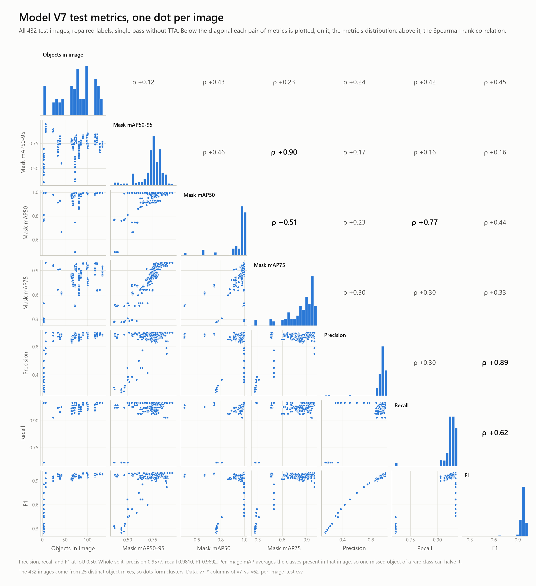
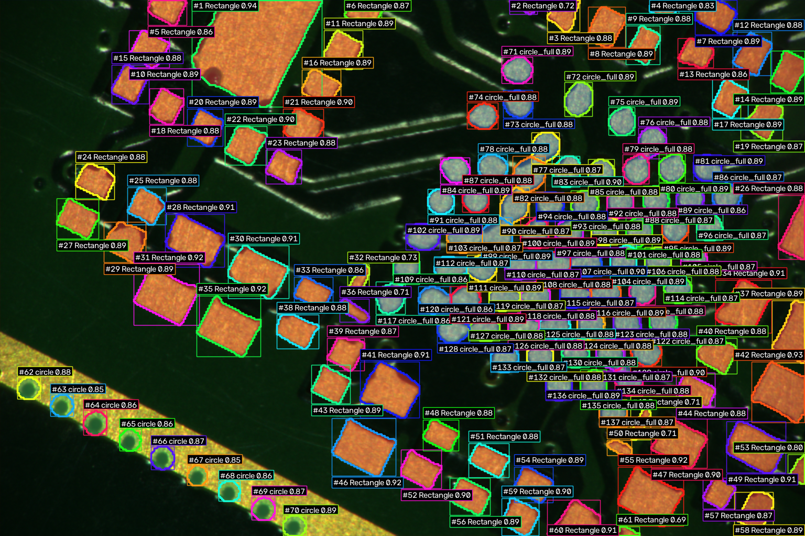
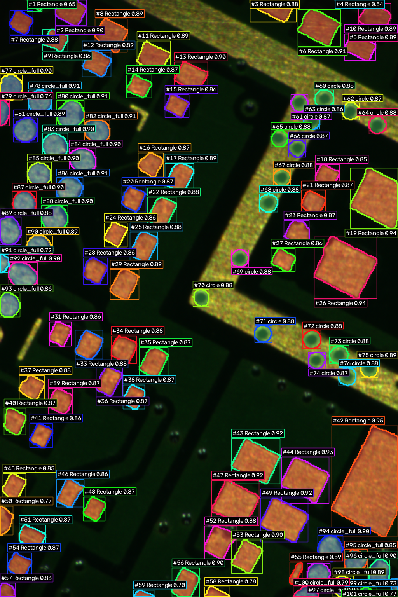
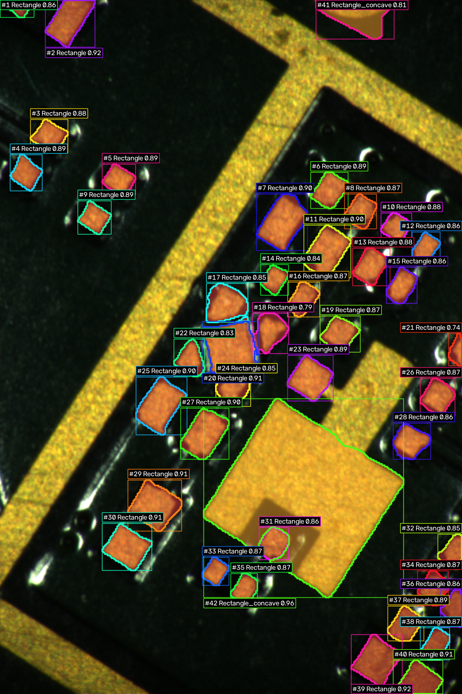

# Model V7 results

Model V7 was trained from scratch for 120 epochs (11–14 Sep 2026) on an NVIDIA RTX PRO 1000 Blackwell Generation Laptop GPU. The released model is the **epoch-105 checkpoint** (`best_model_v7_instance.keras`, 6,343,486 parameters), chosen on the complete validation split. The test split was not used for training or for choosing the checkpoint.

Download the model from [Releases](https://github.com/Jenit88/Model_V7/releases).

## Headline numbers

| split | images | objects | mask mAP50-95 | mAP50 | mAP75 | precision | recall | F1 |
|---|---:|---:|---:|---:|---:|---:|---:|---:|
| validation | 1,048 | 48,388 | **0.8515** | 0.9874 | 0.9712 | 0.9598 | 0.9839 | **0.9717** |
| test | 432 | 33,488 | **0.7554** | 0.9731 | 0.8470 | 0.9577 | 0.9810 | **0.9692** |

Precision, recall and F1 count a predicted mask as correct when its IoU with the labelled object is at least 0.50. Mask mAP50-95 averages mask AP over IoU thresholds 0.50 to 0.95 (101-point interpolation, averaged over the four classes).

Semantic segmentation on the same images:

| split | foreground mIoU | Dice | pixel accuracy |
|---|---:|---:|---:|
| validation | 0.9137 | 0.9548 | 0.9867 |
| test | 0.8422 | 0.9136 | 0.9834 |

## Per class, test split

| class | objects | AP50-95 | AP50 | AP75 | precision | recall | F1 | false positives | missed |
|---|---:|---:|---:|---:|---:|---:|---:|---:|---:|
| Rectangle | 15,156 | 0.8300 | 0.9879 | 0.9634 | 0.9421 | 0.9817 | 0.9615 | 914 | 278 |
| Rectangle_concave | 108 | 0.8235 | 0.9285 | 0.9128 | 0.5025 | 0.9167 | 0.6492 | 98 | 9 |
| circle | 3,272 | 0.5649 | 0.9883 | 0.5492 | 0.9730 | 0.9795 | 0.9762 | 89 | 67 |
| circle_full | 14,952 | 0.8032 | 0.9875 | 0.9628 | 0.9767 | 0.9811 | 0.9789 | 350 | 282 |

## Mask AP by IoU threshold

| split | 0.50 | 0.55 | 0.60 | 0.65 | 0.70 | 0.75 | 0.80 | 0.85 | 0.90 | 0.95 |
|---|---:|---:|---:|---:|---:|---:|---:|---:|---:|---:|
| validation | 0.987 | 0.987 | 0.986 | 0.983 | 0.980 | 0.971 | 0.946 | 0.858 | 0.641 | 0.176 |
| test | 0.973 | 0.971 | 0.957 | 0.933 | 0.894 | 0.847 | 0.784 | 0.681 | 0.464 | 0.050 |

Nearly every object is found (AP50 ≥ 0.97 on both splits); what separates validation from test is how tightly the masks fit at high IoU.

## How the checkpoint was chosen

Three saved checkpoints were scored on all 1,048 validation images. Rule: highest complete-validation instance F1; semantic foreground mIoU, instance recall, and instance precision break ties.

| checkpoint | mask mAP50-95 | mAP50 | precision | recall | F1 | foreground mIoU | chosen |
|---|---:|---:|---:|---:|---:|---:|:---:|
| best instance checkpoint (epoch 105) | 0.8515 | 0.9874 | 0.9598 | 0.9839 | 0.9717 | 0.9137 | yes |
| best semantic checkpoint | 0.8515 | 0.9874 | 0.9598 | 0.9839 | 0.9717 | 0.9137 |  |
| last epoch (120) | 0.8510 | 0.9876 | 0.9596 | 0.9838 | 0.9715 | 0.9132 |  |

The best-instance and best-semantic checkpoints scored identically; the first-ranked one was copied to `best_model_v7_instance.keras`.

## Training setup

- **Model:** `Model_v7_PCB_Scratch_BiFPN_DualContext_DualDecoder`, 6,343,486 parameters, input 512×512 RGB (aspect-preserving letterbox). Outputs: 5-class semantic map (512²), inner-distance field (256²), instance boundary map (512²).
- **Data:** 4,680 training images (151,724 objects), 1,048 validation (48,388), 432 test (33,488). Labels with overlapping polygons were repaired before training.
- **Optimisation:** AdamW, learning rate 3e-04 decaying to 1e-06, batch 2 × 2 gradient accumulation (effective 4), EMA 0.999, gradient clipping 5.0, mixed_float16.
- **Initialisation:** from scratch, no pretrained weights.
- **Software:** TensorFlow 2.21.0, Keras 3.15.1, seed 42.

## Per-image analysis, test split

One dot per test image. The 432 test images come from 25 distinct object mixes, so the dots form clusters. Two clusters are real weaknesses:

- **The lone Rectangle.** On the 20 test images with 1 Rectangle and 71 circle_full, V7 misses the Rectangle (no mask at IoU ≥ 0.50) on 10. Per-image mAP averages the classes present, so that one miss halves the image's score.
- **Few-object images.** On the 20 images with only 2 Rectangle_concave and 1 circle (60 objects in total), V7 makes 112 false positives. These images hold 60 of the 98 Rectangle_concave false positives on test, the main reason that class's test precision is only 0.5025 (108 objects).

`per_image/v7_vs_v62_per_image_test.csv` has every image's numbers. The `v7_` columns are this model; the `v62_` columns are the previous model (V6.2) on the same images and labels, for comparison.

## Example predictions

The released model on three test images, run with the deployment settings (detections below 0.50 confidence dropped). Each label shows the instance number, class and confidence.

**sample_val_000017**: 137 detections

**sample_val_000053**: 99 detections

**sample_val_000039**: 42 detections

## Files

| path | contents |
|---|---|
| `training/training_log.csv` | per-epoch losses and validation metrics |
| `training/instance_checkpoint_history.json` | instance metrics at every 5-epoch evaluation |
| `training/TRAINING_REPORT.md` | report written by the training run after epoch 119 |
| `training/reports/` | mid-run reports at epochs 50 and 100 |
| `training/final_model_selection.json` | the three-checkpoint comparison above |
| `training/training_config.json` | full training configuration |
| `training/model_summary.txt` | layer-by-layer model summary |
| `training/instance_dataset_metadata.json` | classes, preprocessing and split sizes |
| `training/dataset_and_augmentation_preview.png` | training images and augmentations |
| `evaluation/val/`, `evaluation/test/` | complete instance and semantic evaluation reports |
| `per_image/` | scatter matrix and per-image metrics (CSV) |
| `examples/` | example predictions on test images |

## Caveats

- 44 test images are byte-identical to validation images, and validation chose the checkpoint, so the test split is not fully independent. See [the main README](../README.md#caveats-inherited-from-the-v62-measurements).
- `TRAINING_REPORT.md` and `instance_checkpoint_history.json` score a 256-image validation subset during training (0.8501 at epoch 105). The tables above are the final evaluations on the complete splits.
- The examples use a confidence floor of 0.50 with no V7-specific threshold fit; the benchmark numbers use the shipped decoder settings.
